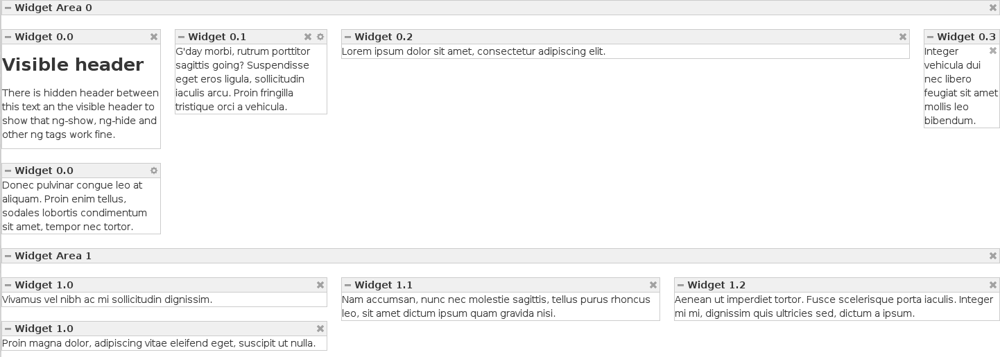

#AngularJS Widget Area directive

## About ##
__pk-widget-areas__ is an AngularJS directive, which allows you to build iGoogle-like dashboard apps (aka portlets or iNettuts).

__Contributors:__

* [Petr Kotek](https://github.com/petrkotek)

License: [MIT](http://www.opensource.org/licenses/mit-license.php)

## Example & Screenshot ##
See example is in index.html.

## Dependencies
* AngularJS & UI (included in index.html from CDN)
* Twitter Bootstrap (the fluid layout; included in index.html from CDN)
* jQuery (included in index.html from CDN)
* jQuery UI (sortable plugin; included in index.html from CDN)
* [AngularJS multi-sortable](https://github.com/mostr/angular-ui-multi-sortable) (included in index.html from lib/angular-ui-multi-sortable.js)

##Change Log##
* __2013-04-22__ - Version 1.0.0 - Release